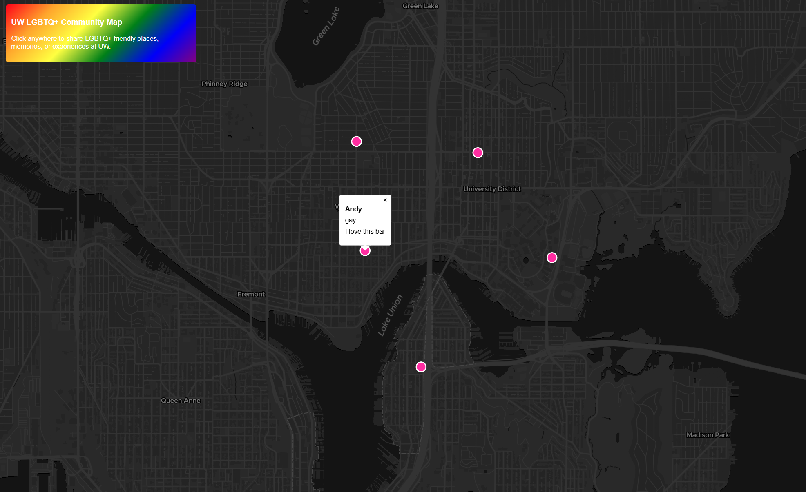

# UW LGBTQ+ Community Map

## AI disclosure

AI is used in this project for:

- Debugging

I did not use AI to write or complete any components where AI use is prohibited. If AI was used for debugging or development, I am able to explain the relevant code and decisions

## Web Map URL
https://allenval.github.io/geog458PGIS/

## Overview

This project is a participatory mapping tool designed for the UW LGBTQ+ community. Users can click anywhere on the map to share LGBTQ+ friendly places, memories, or experiences. Each contribution is stored in a PostgreSQL database and displayed as a colored point on the map.

This map supports community storytelling and helps visualize LGBTQ+ spaces and experiences at the University of Washington.

## Features

- Users can click the map to submit:
  - Name
  - Identity (optional)
  - Message
  - Location
- Data is stored in a cloud PostgreSQL database via Heroku
- Submitted points appear instantly on the map
- Points remain after refresh because they are saved in the database
- Custom LGBTQ+ themed styling

## Technologies Used

- MapLibre GL JS
- JavaScript
- Node.js
- Express
- PostgreSQL (Heroku)
- GitHub Pages
- Heroku

## Screenshot

